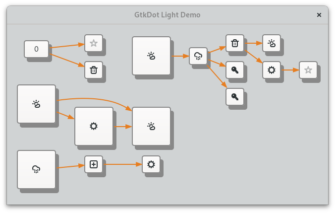
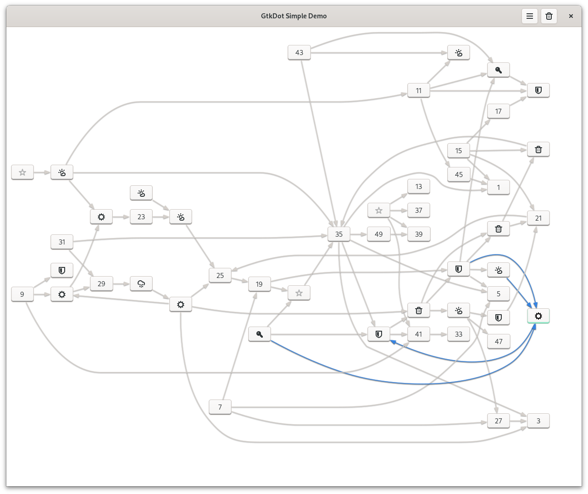

# Gtkdot

A Gtk 4 graph library.

Gtkdot is an experimental integration between Graphviz and Gtk. It makes use of graphviz's Cgraph api
to lay out Gtk.Widgets as diagrams and converts graphviz's xdot format in Gtk 'dialect' to render shapes
( used mainly for drawing edges ).

The library provides 2 Gtk.Widgets that may be used to draw diagrams and 2 demos showcasing their use.
1. LightGraph
2. SimpleGraph (*experimental*)

---

## LightGraph

*LightGraph* is the simplest implementation where all child widgets are considered nodes of the 
resulted graph. Edges may be added between widgets, but no interactions is provided with them.

`gtk-light-demo` is an application showcase LightGraph usage.

---

## SimpleGraph

*SimpleGraph* on the contrary, may contain widgets as either nodes or edges. It provides `SimpleEdge` 
widget to handle edges and any other widget is considered a node of the resulted graph. It provides 
functionality for **adding**, **removing** **selecting** as well as **showing/hiding** nodes and/or edges.
Additionally custom css may change the widgets styling as usuall.

`gtk-simple-demo` is an application showcasing SimpleGraph usage, and there is a [video](https://sendvid.com/00mozbok) demostrating those capabilities.

---

Gtkdot is written in vala and build using meson.

